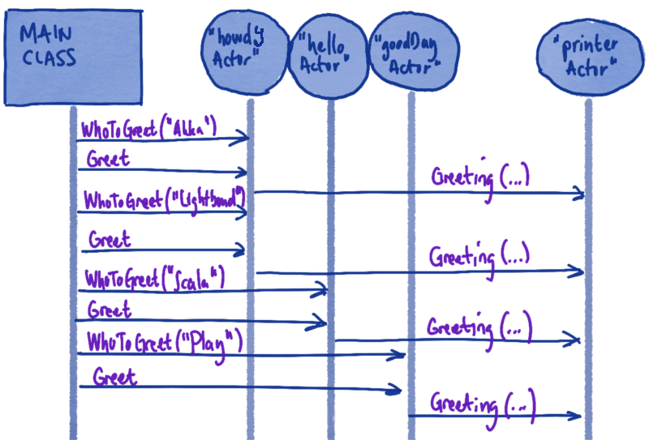

Akka Quickstart with Java
=========================

[Akka](http://akka.io) is a toolkit and runtime for building highly concurrent,
distributed, and fault-tolerant event-driven applications on the JVM. Akka can be used with both Java
and Scala.

This tutorial will guide you through the some basic but fundamental Akka building blocks.

The sample project for this tutorial is called `akka-java-seed` and can be found in [Get started with Lightbend technologies](http://dev.lightbend.com/start/?group=akka&project=akka-java-seed). Unzip the zip file and, if wanted, rename the directory to your preference:

Windows
: ```
Unzip the zip file and then open a Command Line window and change directory into the unzipped project:
$ cd akka-java-seed
```

OSX
: ```
$ unzip akka-java-seed.zip
$ cd akka-java-seed
Note: If you unzip with Archiver instead of via the Terminal you also have to make the sbt files executable:
$ chmod u+x ./sbt
$ chmod u+x ./sbt-dist/bin/sbt
```

Linux
: ```
$ unzip akka-java-seed.zip
$ cd akka-java-seed
```

If you prefer to use Akka with Scala you can find its tutorial [here](http://developer.lightbend.com/start/?group=akka&project=akka-scala-seed).

## The Sample Application

The code in this example is intentionally kept simple. This is a getting started tutorial for someone who has no,
or very little, previous knowledge about Akka. Since this tutorial is using [Java8](http://docs.oracle.com/javase/8/) it is good if the reader has a basic understanding thereof.

The aim of this tutorial is to show the interested reader some core concepts of Akka that will not take more than approximately 30 minutes. It will get our feet wet and, hopefully, inspire us to dive deeper into the wonderful sea of Akka!

### Design

We will create a main class from which we create an `akka.actor.ActorSystem` (think of this as a container in which your Actors run). Once we have created an `ActorSystem` we create a couple of Actors; 3 instances of a `Greeter` Actor and 1 instance of a `Printer` Actor. We will thereafter send messages to the `Greeter` Actor instances which will keep these messages internally. Finally, we send instruction messages to our `Greeter` Actors that will trigger them to send messages to the `Printer` Actor for output.

Let's take a look at the architecture. As said above, we will run everything from the main class. The main class will create and interact with the Actors:


Once we have created the Actors we will send messages to them:



Don't worry if this doesn't make complete sense at this point! This tutorial will describe all the core concepts you need to build an Akka application.

## The 3 Minute Exploration

If you don't want to go through all the steps of this tutorial you can jump straight @ref:[full example](full-example.md) to see the source code and then to @ref:[running the application](running-the-application.md). This way you can look at the code and the output and get a very brief introduction to Akka. It is, however, recommended that you follow this tutorial step-by-step to gain a good understanding of the core concepts of Akka.

If you are interested in an more in-depth understanding of the core concepts we recommend the [Getting Started Guide](http://doc.akka.io/docs/akka/2.5/java.html).

Next, let's dive into the tutorial and its individual building blocks.

@@@index

* [Define the Messages](define-messages.md)
* [Define the Actors](define-actors.md)
* [Create the Actors](create-actors.md)
* [Communicate with Actors](communicate-with-actors.md)
* [The Main Class](main-class.md)
* [Full Example](full-example.md)
* [Testing Actors](testing-actors.md)
* [Running the Application](running-the-application.md)
* [IntelliJ](intellij-idea.md)

@@@
